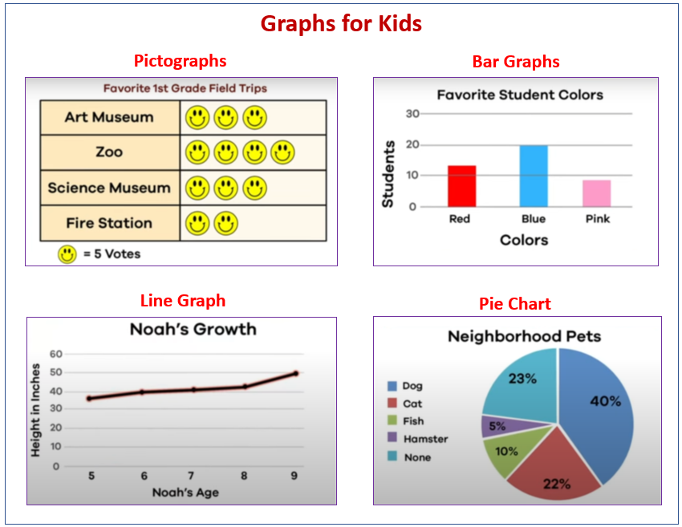
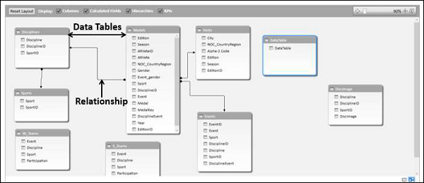

# Day-2-Portfolio-Creation-Class
This is an Inventory management system analysis for Data Transformation, SQL, PowerBi and Tableau

## Introduction ##
This is an analysis to optimize inventory management for Amazon AWS by analyzing sales and inventory data using SQL & PowerBi ( Photo Credit ; Google Kids)
 
 
 
 

 ## PROBLEM STATMENT:
The primary objective of this project is to increase net revenue for Example company's premium product line of widgets by 5% in the next fiscal year. The specific objectives include:

- Assessing the current workforce and identifying the gaps in the marketing, PR, and product development teams.
- Expanding the marketing and PR teams by hiring skilled professionals who can effectively promote the premium product line and engage with the target audience.
- Strengthening the product development teams by recruiting qualified individuals who can drive innovation, enhance product features, and meet customer demands.
- Developing a comprehensive marketing and PR strategy to effectively communicate the value proposition of the premium product line and attract new customers.

- ## DATA SOURCE ##
- Public health data: Information on population health and disease trends
- Social media platforms: Data from user interactions and content on platforms like - - Facebook, Twitter, and Instagram
- Market research reports: Studies conducted by specialized research firms
- Government databases: Statistical and demographic data from government agencies

  ## DATA MODELING ##
  The intelligence in PowerBi makes it such that tables are automatically joined by creating relationships with them.

  OLD MODEL                  |  NEW MODEL
  :----------------------:   | :----------------------:
        | 

   ## CONCLUSION ##
Today is the Year of Our Lord!!!!
